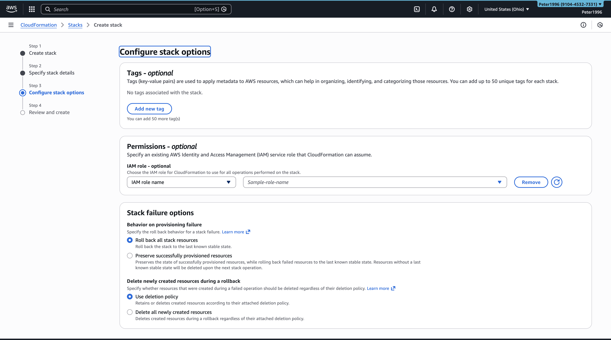
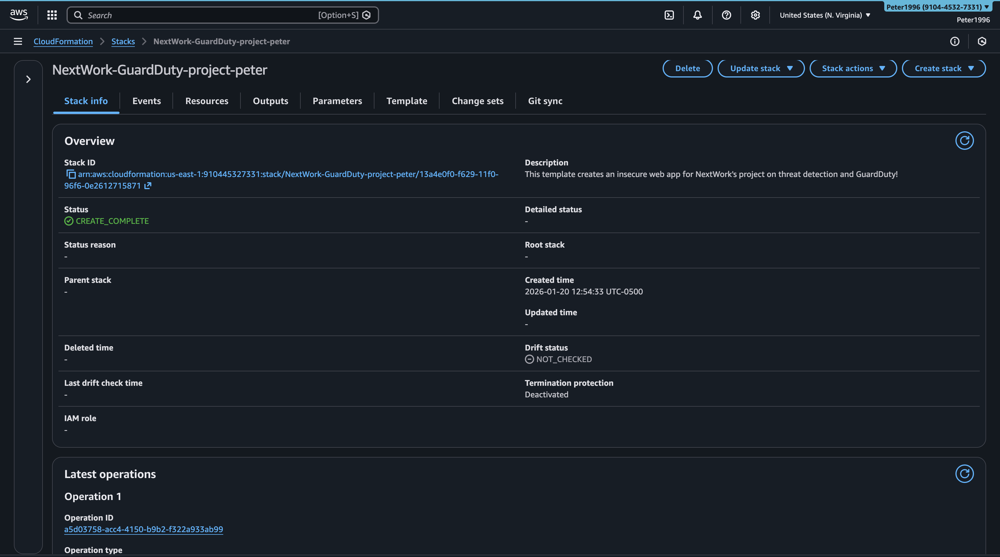
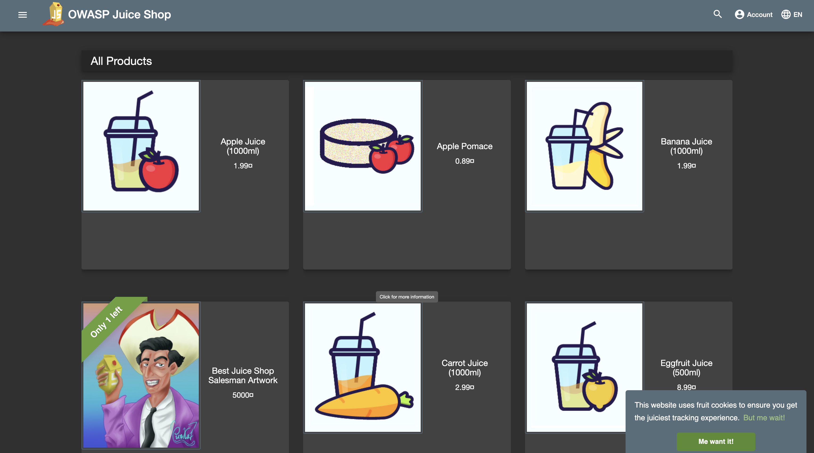
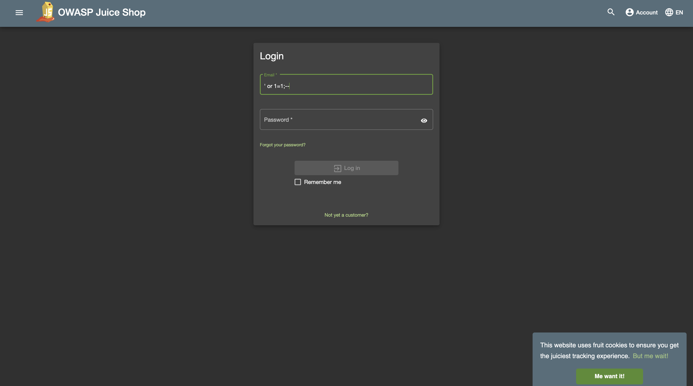
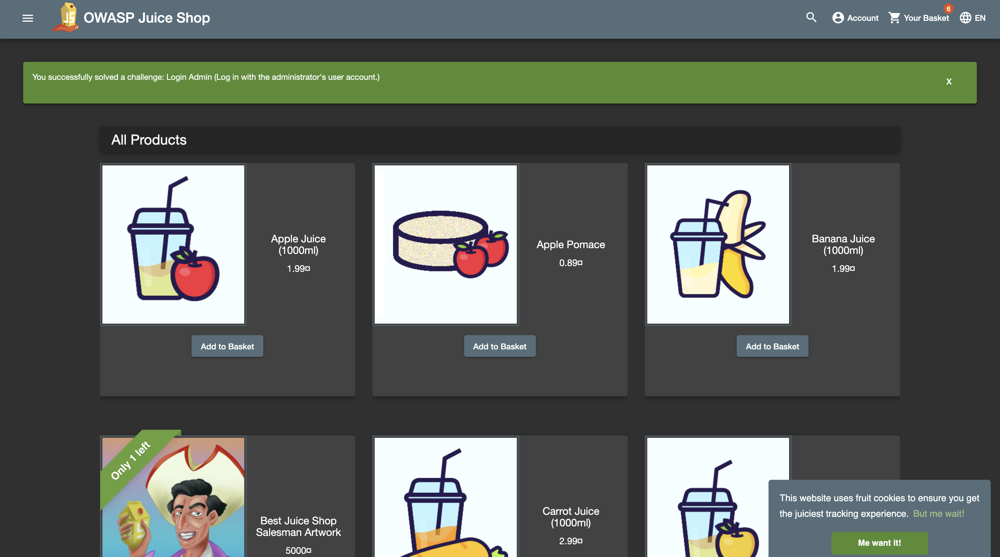
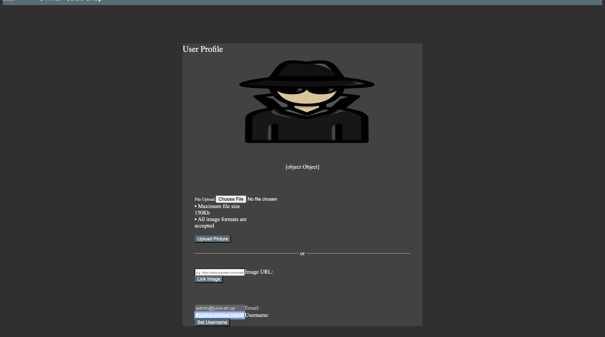
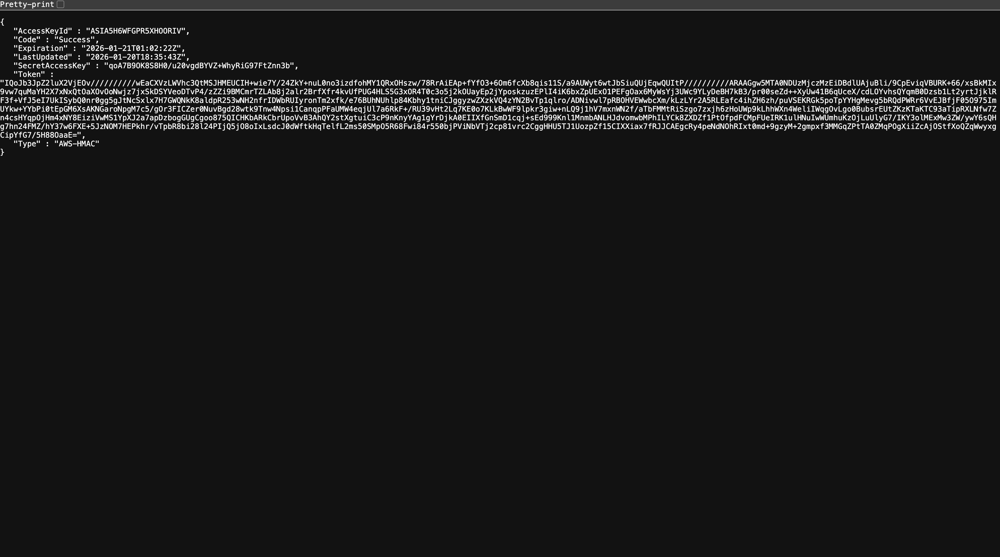
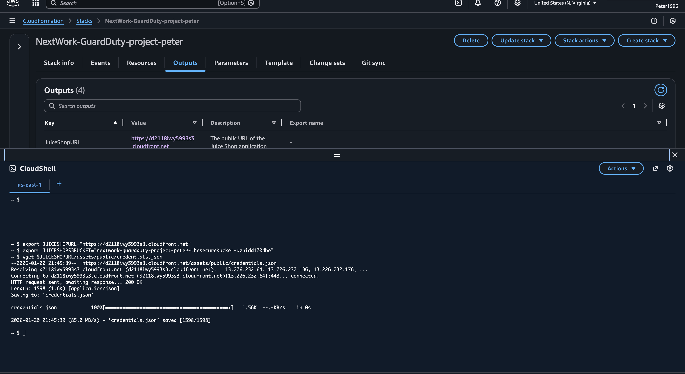
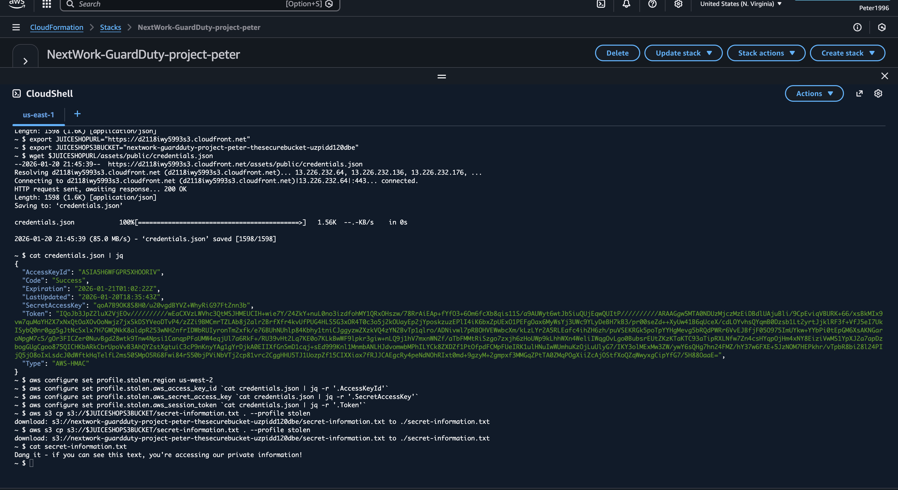
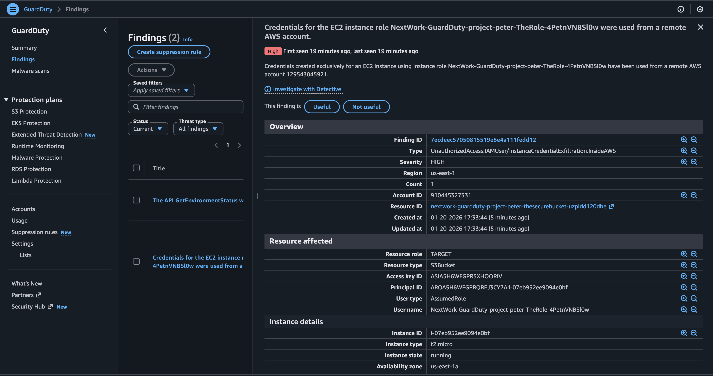

# AWS GuardDuty Threat Detection Lab

This project demonstrates how **Amazon GuardDuty** detects real-world attack behavior in a controlled AWS lab environment.

I deployed an intentionally vulnerable web application using **AWS CloudFormation**, simulated multiple attack techniques, and analyzed the **security findings generated by GuardDuty**, including credential misuse and malware detection.

> All activity was performed in a lab environment for educational purposes.

---

## Services & Tools Used
- **Amazon GuardDuty** – Threat detection and security findings
- **AWS CloudFormation** – Automated environment deployment
- **Amazon EC2 (Elastic Compute Cloud)** – Hosted vulnerable web application
- **Amazon S3 (Simple Storage Service)** – Object storage and malware scanning
- **AWS CloudShell** – Command-line access for attack simulation

---

## Project Architecture (High Level)
1. CloudFormation deployed a vulnerable web application (OWASP Juice Shop).
2. GuardDuty was enabled to monitor activity across the AWS account.
3. Attack techniques were simulated against the application.
4. GuardDuty analyzed logs, behavior, and network activity.
5. Security findings were generated and reviewed.

---

## Step-by-Step Walkthrough (With Evidence)

### 1️⃣ Environment Deployment
**What I did:**  
I deployed the lab infrastructure using an AWS CloudFormation template. This automatically created the vulnerable web application, supporting resources, and enabled GuardDuty monitoring.

**Outcome:**  
The stack successfully deployed and all required resources were created.

---

### 2️⃣ Vulnerable Web Application Access
**What I did:**  
I accessed the deployed OWASP Juice Shop web application to confirm it was running and reachable.

---

### 3️⃣ SQL Injection Attack
**What I did:**  
I performed a **SQL (Structured Query Language) injection** attack to bypass authentication by manipulating login input.

**Outcome:**  
The SQL injection succeeded, granting unauthorized access to the application.

---

### 4️⃣ Command Injection Attack
**What I did:**  
I exploited a **command injection vulnerability** to execute system-level commands through the web application.

**Impact:**  
This demonstrated how attackers can gain deeper access to backend systems when applications are improperly secured.

---

### 5️⃣ Credential Access & CloudShell Usage
**What I did:**  
I simulated the use of exposed credentials to access AWS resources.

I then used **AWS CloudShell** to interact with cloud resources as if credentials had been compromised.

**Outcome:**  
The credentials allowed successful access, simulating a real-world credential exfiltration scenario.

---

### 6️⃣ Amazon GuardDuty Findings
**What I did:**  
I reviewed the GuardDuty findings generated from the attack activity.

**Key Finding Observed:**  
`UnauthorizedAccess:IAMUser/InstanceCredentialExfiltration.InsideAWS`

This indicates GuardDuty detected anomalous use of instance credentials inside AWS.

---

### 7️⃣ Malware Detection (S3)
**What I did:**  
I uploaded a malware test file (EICAR test string) to Amazon S3 to verify GuardDuty malware detection capabilities.

**Outcome:**  
GuardDuty successfully identified the object as malicious and generated a malware finding.

---

## Key Skills Demonstrated
- Cloud security monitoring
- Threat detection and analysis
- Attack simulation (SQL injection, command injection)
- Credential misuse detection
- Malware detection in Amazon S3
- Interpreting GuardDuty findings and severity

---

## Documentation
- 📄 Full lab documentation:  
  **GuardDuty-Threat-Detection-Lab.pdf**

---

## Cleanup
All AWS resources (CloudFormation stack, EC2 instances, and S3 objects) were deleted after testing to avoid ongoing costs.
